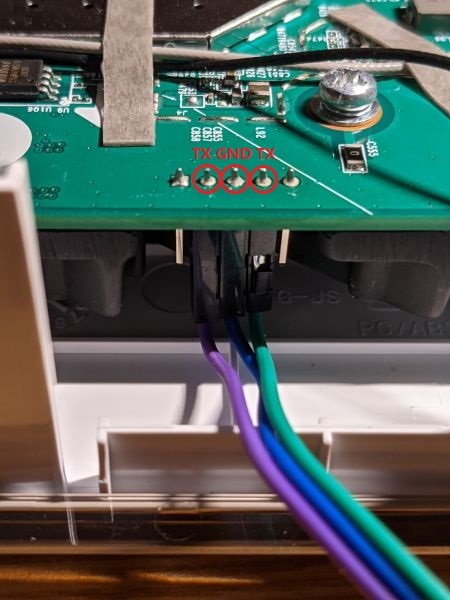

# QNAP QHora-301W 产品介绍

## [官方介绍](https://www.qnap.com/zh-cn/product/qhora-301w)

## 硬件参数
- CPU: 高通 Networking Pro 1200 平台 [IPQ8072A](pic/IPQ8072A.jpg) 四核 Cortex-A53 2.2GHz
- 内存: 1024MB of DDR3
- 闪存: 4GB eMMC (包含固件操作系统分区kernel和rootfs等) 和 8MB NOR (包含art mibib cdt uboot等启动引导分区)
- 有线网络: 4个1Gbps RJ45 接口（PHY芯片：QCA8075） + 2个六速自适应10Gbps RJ45接口 （PHY芯片：Aquantia AQR113C）
- 无线网络:
  - 2.4GHz: 高通 QCN5024 4x4 802.11b/g/n/ax 1174 Mbps速率
  - 5GHz: 高通 QCN5054 4x4 802.11a/b/g/n/ac/ax 2402速率，支持160MHZ频宽
- LED灯:
  - 7个 GPIO 可编程黄/绿色LED指示灯
  - 2个 GPIO 可编程单色LED指示灯
- USB接口
  - 2个 USB3.0接口
- 按键: 1个 reset键、1个 WPS按键、1个电源开关键
- 电源: 12V DC接口

## 闪存分区表

### MTD

```
dev:    size   erasesize  name
mtd0: 00050000 00010000 "0:SBL1"
mtd1: 00010000 00010000 "0:MIBIB"
mtd2: 00180000 00010000 "0:QSEE"
mtd3: 00010000 00010000 "0:DEVCFG"
mtd4: 00010000 00010000 "0:APDP"
mtd5: 00040000 00010000 "0:RPM"
mtd6: 00010000 00010000 "0:CDT"
mtd7: 00020000 00010000 "0:APPSBLENV"
mtd8: 00100000 00010000 "0:APPSBL"
mtd9: 00040000 00010000 "0:ART"
mtd10: 00080000 00010000 "0:ETHPHYFW"
mtd11: 003d0000 00010000 "reserved"
```

### MMC

```
Partition Map for MMC device 0  --   Partition Type: EFI

Part	Start LBA	End LBA		Name
	Attributes
	Type GUID
	Partition GUID
  1	0x00000022	0x00008021	"0:HLOS"  attrs:	0x0000000000000000  type:	b51f2982-3ebe-46de-8721-ee641e1f9997  guid:	1a373c3c-588e-eff4-5182-68ad83e0e62e
  2	0x00008022	0x00010021	"0:HLOS_1"  attrs:	0x0000000000000000  type:	a71da577-7f81-4626-b4a2-e377f9174525  guid:	7d35f31d-0980-2220-edfd-6228595b79d2
  3	0x00010022	0x00018021	"0:HLOS_2"  attrs:	0x0000000000000000  type:	3e972198-336f-11ea-baa1-52540063a6b7  guid:	964e7e67-6666-7303-312a-291b757640e8
  4	0x00018022	0x00118021	"rootfs"  attrs:	0x0000000000000000  type:	98d2248d-7140-449f-a954-39d67bd6c3b4  guid:	2a213133-47f8-80a1-5d66-1d565a2ec756
  5	0x00118022	0x00218021	"rootfs_1"  attrs:	0x0000000000000000  type:	5647b280-dc2a-485d-9913-cf53ac40fa32  guid:	77f91baf-6750-e138-dbe5-434eaeded6dd
  6	0x00218022	0x00318021	"rootfs_2"  attrs:	0x0000000000000000  type:	cd26dc90-3370-11ea-baa1-52540063a6b7  guid:	8530d17c-21e3-f82b-12ec-87fd429a600e
  7	0x00318022	0x0031a021	"0:WIFIFW"  attrs:	0x0000000000000000  type:	5911fd72-35be-424e-975d-69c957ad3a43  guid:	9420c4b0-ba83-2b38-6ba6-2839be048c92
  8	0x0031a022	0x00322021	"reserved"  attrs:	0x0000000000000000  type:	8da63339-0007-60c0-c436-083ac8230908  guid:	e590e607-3410-795e-afbc-888e9b2ea17b
  9	0x00322022	0x0073d821	"rootfs_data" attrs:	0x0000000000000000  type:	ab1760da-a8bb-4d6f-98d2-9ad3ab9009cd  guid:	d1402149-3e8e-0709-99d9-170bfab2f66c
```

## TTL接线图

接中间3根，从左到右分别是TX-GND-RX，参数设置115200, 8N1, 3.3 V



