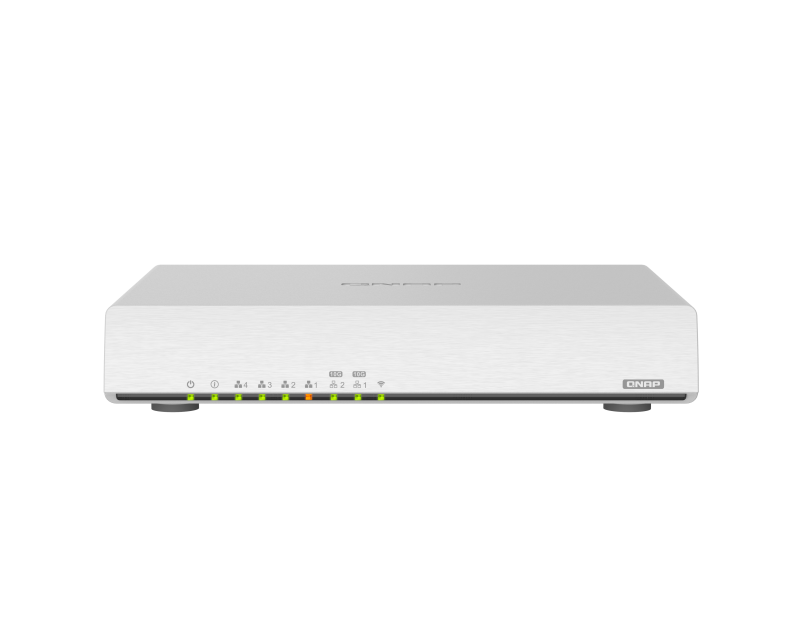
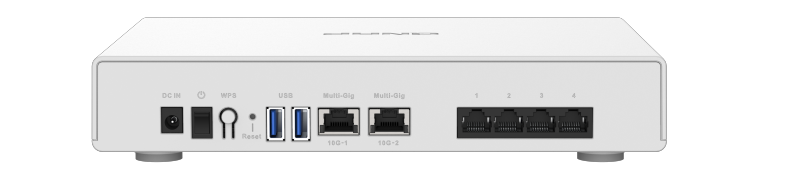

# QNAP QHora-301W产品介绍

## 硬件参数
- CPU: Qualcomm IPQ8072A Quad core Cortex-A53 2.2GHz
- 内存: 1024MB of DDR3
- 闪存: 4GB eMMC (包含固件操作系统分区kernel和rootfs等) 和 8MB NOR (包含uboot等启动引导分区)
- 有线网络: 4个1G RJ45 接口（PHY芯片：QCA8075） + 2个10G 接口 （PHY芯片：Aquantia AQR113C）
- 无线网络:
  - 2.4GHz: Qualcomm QCN5024 4x4 802.11b/g/n/ax 1174 Mbps PHY rate
  - 5GHz: Qualcomm QCN5054 4x4 802.11a/b/g/n/ac/ax 2402 PHY rate
- LEDs:
  - 7 x GPIO-controlled dual color LEDs + 2 GPIO-controlled single color LEDs
- 按键: 1个 reset键、1个 WPS按键、1个电源开关键
- 电源: 12V DC接口

## 产品图示

