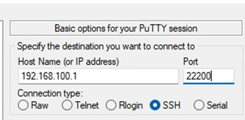
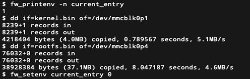

# QNAP 301w 免拆刷机方法

### 特别感谢 [@coolsnowwolf](https://github.com/coolsnowwolf) [@asushugo](https://github.com/asushugo) 等一众牛B的开发者适配301w路由器

### 1. 开启SSH服务

在开启路由器可以正常进系统的状态下，长按路由器后的 WPS 键，直到听到第二声“嘟”松开（大约 12 秒）就 OK。

---

### 2. SSH连接路由器后台

这里需要注意一点

- 路由器默认开启的SSH的端口号是 **22200**

- 用户名是`admin`，密码是路由器网页登录密码

ssh命令就是 `ssh admin@192.168.100.1 -p 22200`（ 如果端口没开重复步骤1 ）

或者使用putty连接



---

### 3. 将分区切换到第二分区

`sudo fw_setenv current_entry 1` 提示要输入的密码就是刚刚你登录 ssh 的密码，以下不再赘述

`sudo reboot`  重启

---

### 4. 检查路由器当前启动分区

`sudo fw_printenv -n current_entry`

查看分区，确保这里会输出 1，如果不是，重复部署3。

---

### 5. 使用 Winscp 上传QSDK的 kernel.bin 和 rootfs.bin 到 /tmp （！别问我固件从哪儿拿）

---

### 6. 将QSDK到刷入第一分区

*注意：强烈建议使用dd命令（方法自行搜索引擎）备份一些重要的分区例如mtd闪存分区以及mmc闪存分区，以便以后可以恢复官方固件*

```sh
sudo dd if=/tmp/kernel.bin of=/dev/mmcblk0p1
sudo dd if=/tmp/rootfs.bin of=/dev/mmcblk0p4
sudo fw_setenv current_entry 0
sudo fw_setenv boot_0 good
sudo reboot
```
截图参考：



然后重启即可，注意由于没有刷10G PHY的firmware当前10G口没有启动

---

### 7. 301w刷入 10G PHY 的 firmware 方法

1. 将AQR_ethphyfw_5.6.7.mbn用scp命令或者winscp工具传输到QSDK的/tmp目录下
2. 使用putty或其他ssh工具进路由器后台，抹除原ethfw分区 mtd10的数据：`mtd erase /dev/mtd10`
3. 刷入fw文件：`mtd -n write /tmp/AQR_ethphyfw_5.5.6.mbn /dev/mtd10`
4. 修改bootcmd环境变量：`fw_setenv bootcmd "aq_load_fw 0; aq_load_fw 8; bootipq"`
5. `fw_printenv` 看下是否有这条记录 bootcmd=aq_load_fw 0; aq_load_fw 8; bootipq ，如果有就没问题。
6. 重启
